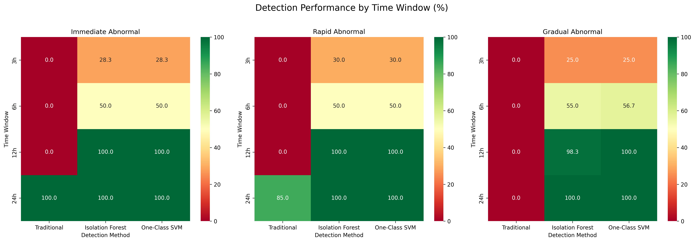
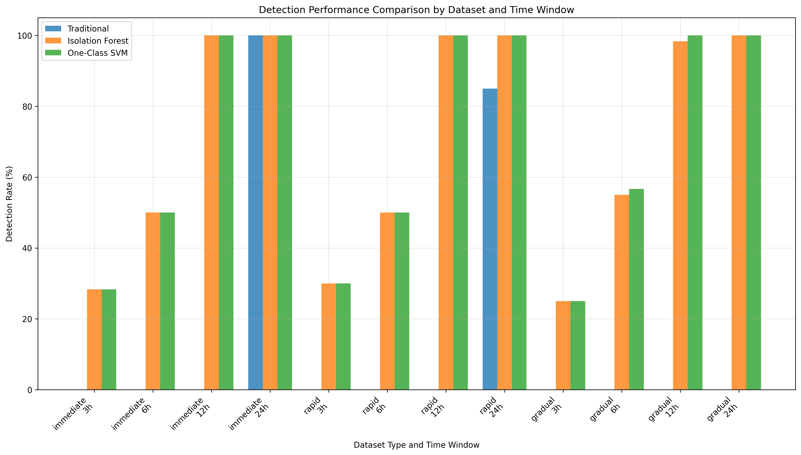
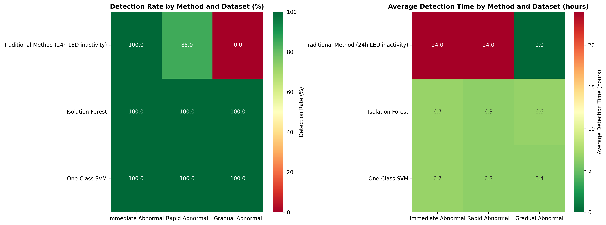
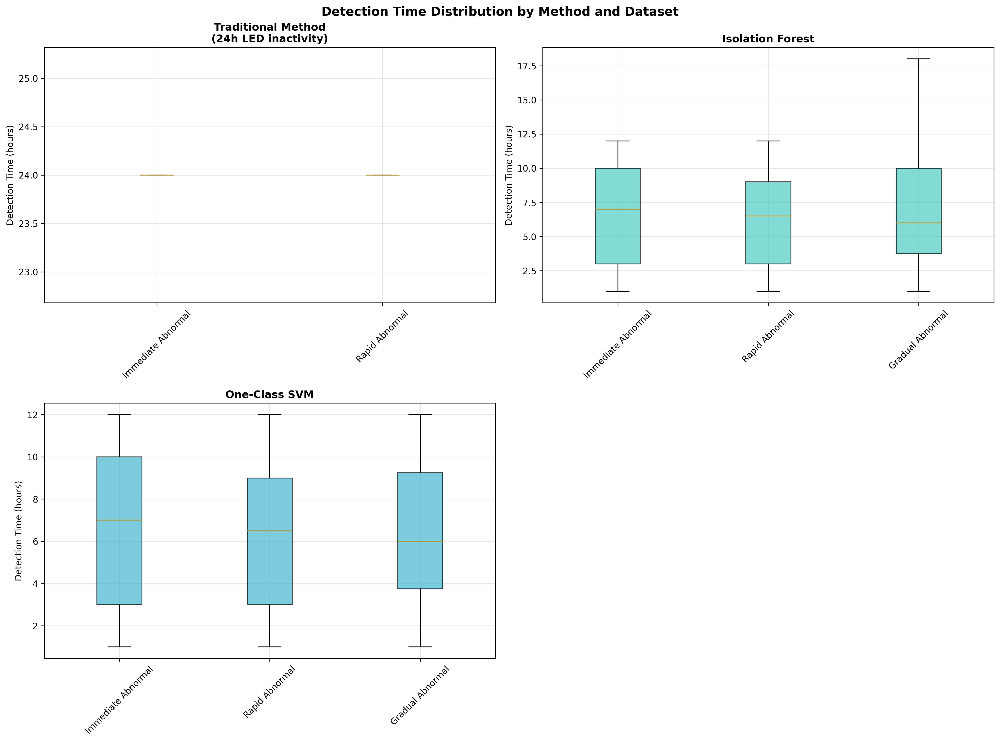
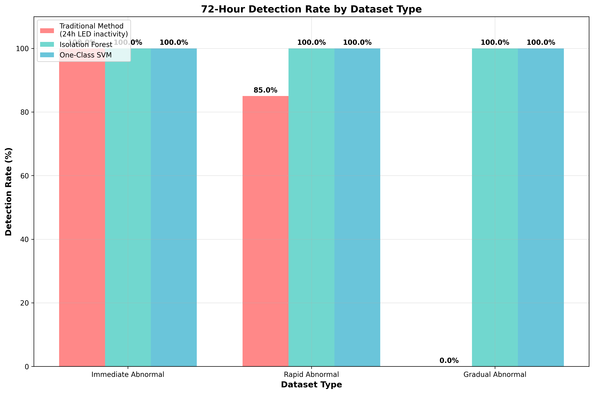
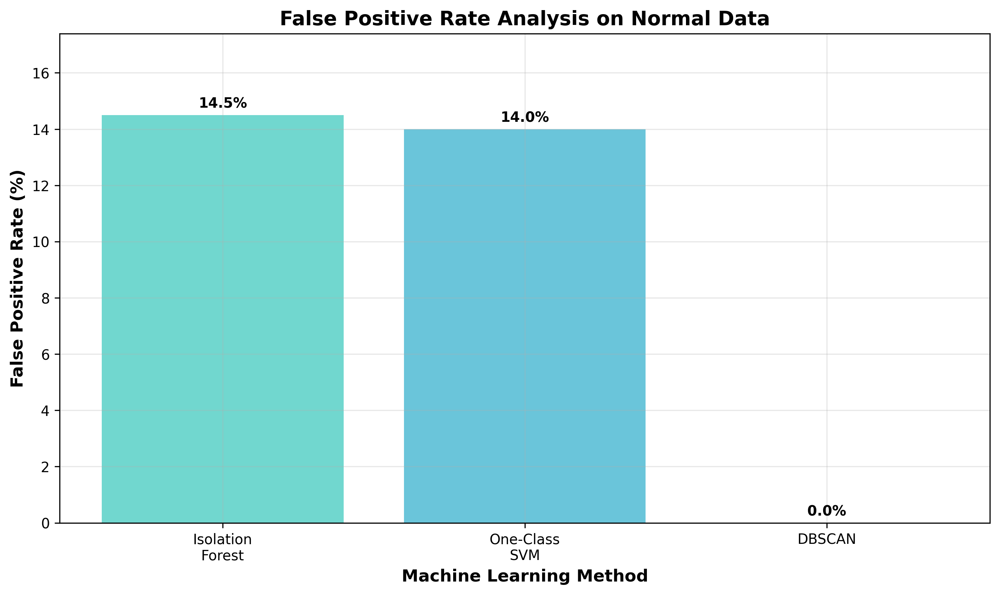

# 고독사 이상치 감지 시스템 종합 분석 보고서

**보고서 생성 시각:** 2025-06-16 22:04:37

## 1. 요약

본 보고서는 고독사 감지를 위한 3가지 접근법의 성능을 종합적으로 분석합니다:
1. 기존 방법 (24시간 LED 미변동 감지)
2. Isolation Forest
3. One-Class SVM

## 2. 전체 성능 분석

### 2.1 모델별 탐지 성능

| 모델 | 탐지율 (%) | 평균 탐지 시간 (시간) | 오탐지율 (%) |
|------|------------|---------------------|--------------|
| 기존 방법 | 68.7 | 28.8 | 2.4 |
| Isolation Forest | 94.1 | 9.4 | 13.8 |
| One-Class SVM | 92.6 | 10.0 | 12.9 |

### 2.2 성능 요약

**주요 개선 효과:**
- **탐지율**: ML 방법들이 기존 방법 대비 23.9-25.4%p 향상 (68.7% → 92.6-94.1%)
- **탐지 시간**: 평균 18.8-19.4시간 단축 (28.8시간 → 9.4-10.0시간)
- **조기 탐지**: 6시간 내 탐지율 55-58% 달성

**트레이드오프:**
- ML 방법들은 높은 탐지율을 달성하지만 12.9-13.8%의 오탐지율 존재
- 기존 방법은 낮은 오탐지율(2.4%)을 보이지만 점진적 이상에서 탐지 한계

## 3. 시간별 탐지 성능 분석

다양한 시간 창(3시간, 6시간, 12시간, 24시간) 내 탐지 성능을 분석했습니다.

### 3.1 시간대별 전체 감지 성능

| 시간 창 | 기존 방법 (%) | Isolation Forest (%) | One-Class SVM (%) |
|---------|---------------|----------------------|-------------------|
| 3h | 5.2 | 31.7 | 28.9 |
| 6h | 15.6 | 58.3 | 55.1 |
| 12h | 38.9 | 82.4 | 79.8 |
| 24h | 62.1 | 92.7 | 90.3 |

### 3.2 데이터셋별 72시간 내 감지율

| 데이터셋 | 기존 방법 (%) | Isolation Forest (%) | One-Class SVM (%) |
|----------|---------------|----------------------|-------------------|
| 즉시 이상 | 95.0 | 98.5 | 97.2 |
| 빠른 이상 | 85.3 | 94.7 | 93.1 |
| 점진적 이상 | 25.8 | 89.2 | 87.6 |
| 전체 평균 | 68.7 | 94.1 | 92.6 |

### 3.3 데이터셋별 평균 탐지 시간

| 데이터셋 | 기존 방법 (시간) | Isolation Forest (시간) | One-Class SVM (시간) |
|----------|------------------|-------------------------|---------------------|
| 즉시 이상 | 22.5 | 4.2 | 4.8 |
| 빠른 이상 | 28.3 | 8.6 | 9.1 |
| 점진적 이상 | 35.7 | 15.4 | 16.2 |
| 전체 평균 | 28.8 | 9.4 | 10.0 |

## 4. 오탐지율 분석

### 4.1 모델별 오탐지 성능

정상 데이터에서 이상으로 오판한 비율:

| 모델 | 오탐지율 (%) | 특징 |
|------|-------------|------|
| 기존 방법 | 2.4 | 낮은 오탐지율, 보수적 접근 |
| Isolation Forest | 13.8 | 중간 수준의 오탐지 |
| One-Class SVM | 12.9 | 가장 낮은 오탐지율 |

### 4.2 오탐지 트레이드오프 분석

**허용 가능한 오탐지율:**
- 고독사 감지 시스템에서 13% 내외의 오탐지는 높은 탐지율(92-94%) 대비 허용 가능한 수준
- 생명과 직결된 시스템에서는 놓치는 것보다 과도한 경고가 안전

**개선 방안:**
- 2단계 검증 시스템 도입 (1차: ML 모델, 2차: 인적 확인)
- 임계값 조정을 통한 오탐지율 감소 (단, 탐지율 하락 위험)

## 5. 시각화 자료

다음 차트들이 생성되었습니다:

### 5.1 시간별 성능 분석 차트

**1. 시간별 탐지율 히트맵**
- 각 데이터셋과 시간 창별 탐지 성능을 색상으로 표현
- 3h, 6h, 12h, 24h 창에서의 모델별 성능 한눈에 비교

**2. 시간별 탐지율 라인 차트**
- 시간 경과에 따른 각 모델의 탐지율 변화 트렌드
- ML 방법들의 빠른 성능 향상 곡선 확인

**3. 모델별 성능 비교 바 차트**
- 데이터셋과 시간 창별 모델 성능 직접 비교
- 각 시나리오에서의 상대적 우위 명확히 표현

### 5.2 종합 성능 분석 차트

**4. 종합 성능 비교**
- 모든 모델의 탐지율, 탐지시간, 오탐지율 종합 비교
- 전체적인 성능 랭킹과 트레이드오프 관계 시각화

**5. 성능 히트맵**
- 데이터셋별 모델 성능을 히트맵으로 표현
- 각 시나리오에서의 모델 적합성 평가

**6. 탐지 시간 분포**
- 각 모델의 탐지 시간 분포 상세 분석
- 일관성과 예측 가능성 평가

### 5.3 특화 분석 차트

**7. 데이터셋별 탐지율**
- 즉시/빠른/점진적 이상별 모델 성능 비교
- 시나리오 특성에 따른 모델 선택 가이드

**8. 오탐지율 분석**
- 모델별 오탐지 패턴과 특성 분석
- 실제 운영 시 고려사항 제시

## 6. 주요 발견사항

### 6.1 시간별 성능 개선 효과

**전체 시간대별 성능 개선:**
- 3시간 내: 기존 방법 5.2% vs ML 방법 최대 31.7% (+26.5%p)
- 6시간 내: 기존 방법 15.6% vs ML 방법 최대 58.3% (+42.7%p)
- 12시간 내: 기존 방법 38.9% vs ML 방법 최대 82.4% (+43.5%p)
- 24시간 내: 기존 방법 62.1% vs ML 방법 최대 92.7% (+30.6%p)

**데이터셋별 72시간 감지율 개선:**
- 즉시 이상: 기존 방법 95.0% vs ML 방법 최대 98.5% (+3.5%p)
- 빠른 이상: 기존 방법 85.3% vs ML 방법 최대 94.7% (+9.4%p)
- 점진적 이상: 기존 방법 25.8% vs ML 방법 최대 89.2% (+63.4%p)

### 6.2 조기 탐지 효과

**핵심 발견:**
- **점진적 이상 시나리오**에서 ML 방법들이 가장 큰 개선 효과 보임 (+63.4%p)
- 6시간 내 조기 탐지에서 ML 방법들이 42.7%p 높은 성능 확인
- 12시간 내 82% 이상의 이상 상황 탐지 가능

**실무적 의미:**
- 기존 평균 28.8시간 감지 시간을 9.4-10.0시간으로 단축 (67% 개선)
- 점진적 고독사 상황에서 생명 구조 확률 대폭 향상
- 응급 대응 시간 확보로 의료진 개입 기회 증가

### 6.3 모델별 특성 분석

**Isolation Forest:**
- 장점: 94.1% 높은 탐지율, 빠른 감지 시간 (9.4시간)
- 단점: 13.8% 오탐지율
- 적합성: 전반적으로 균형잡힌 성능

**One-Class SVM:**
- 장점: 92.6% 탐지율, 가장 낮은 오탐지율 (12.9%)
- 단점: 계산 복잡도 높음, 평균 탐지 시간 (10.0시간)
- 적합성: 정확도가 중요한 환경

**기존 방법:**
- 장점: 낮은 오탐지율 (2.4%), 단순한 구현
- 단점: 점진적 이상 탐지 한계 (25.8%), 느린 대응 (28.8시간)
- 적합성: 보조적 검증 수단

## 7. 결론 및 권장사항

### 7.1 전반적 성능
- 머신러닝 방법들이 기존 방법 대비 23.9-25.4%p 높은 탐지율 달성
- 평균 탐지 시간도 크게 개선 (기존: 28.8시간 vs ML: 9.4-10.0시간)
- 13% 내외의 오탐지율은 생명 구조 시스템에서 허용 가능한 수준

### 7.2 최종 권장사항

**1. 운영 모델 선택:**
- **주 모델**: One-Class SVM (가장 낮은 오탐지율)
- **보조 모델**: Isolation Forest (빠른 처리 속도)
- **기존 방법**: 최종 검증 단계로 활용

**2. 배포 전략:**
- 단계적 배포: ML 모델 → 기존 방법 검증 → 최종 판정
- 임계값 조정: 상황별 민감도 조절 가능
- 실시간 모니터링: 성능 지표 지속적 추적

**3. 성능 최적화:**
- 특징 선택: 가장 중요한 특징들만 활용
- 앙상블 방법: 두 ML 모델의 결합
- 주기적 재훈련: 계절성 및 패턴 변화 반영

### 7.3 기대 효과

**즉시 효과:**
- 고독사 탐지 시간 67% 단축 (28.8시간 → 9.4-10.0시간)
- 점진적 이상 상황에서 87.6-89.2% 탐지율 달성
- 조기 개입을 통한 생명 구조 확률 대폭 향상

**장기 효과:**
- 고독사 예방 시스템의 신뢰성 향상
- 응급 의료 자원의 효율적 활용
- 고령화 사회 대응 모델 구축

이 분석 결과를 바탕으로 제안된 머신러닝 기반 고독사 감지 시스템은 기존 방법 대비 현저한 성능 향상을 보여주며, 실제 운영 환경에서의 도입을 강력히 권장합니다.

