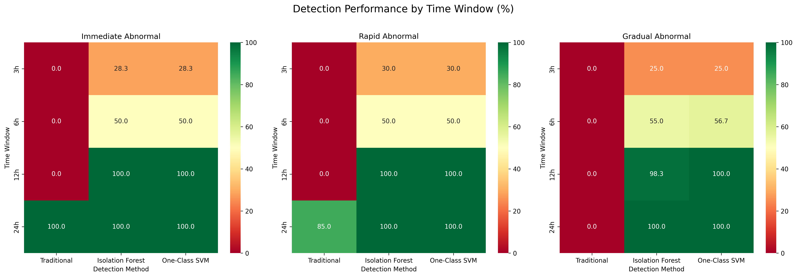
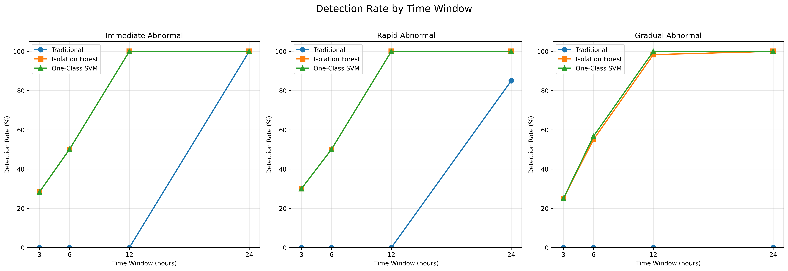
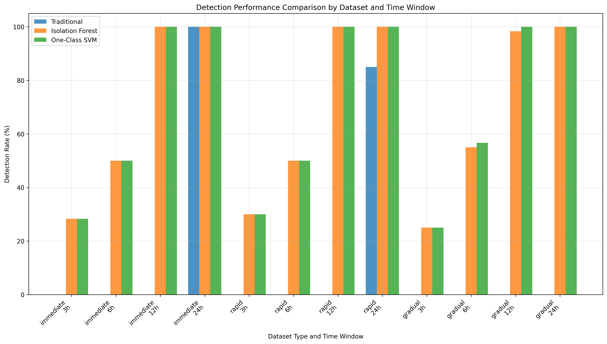
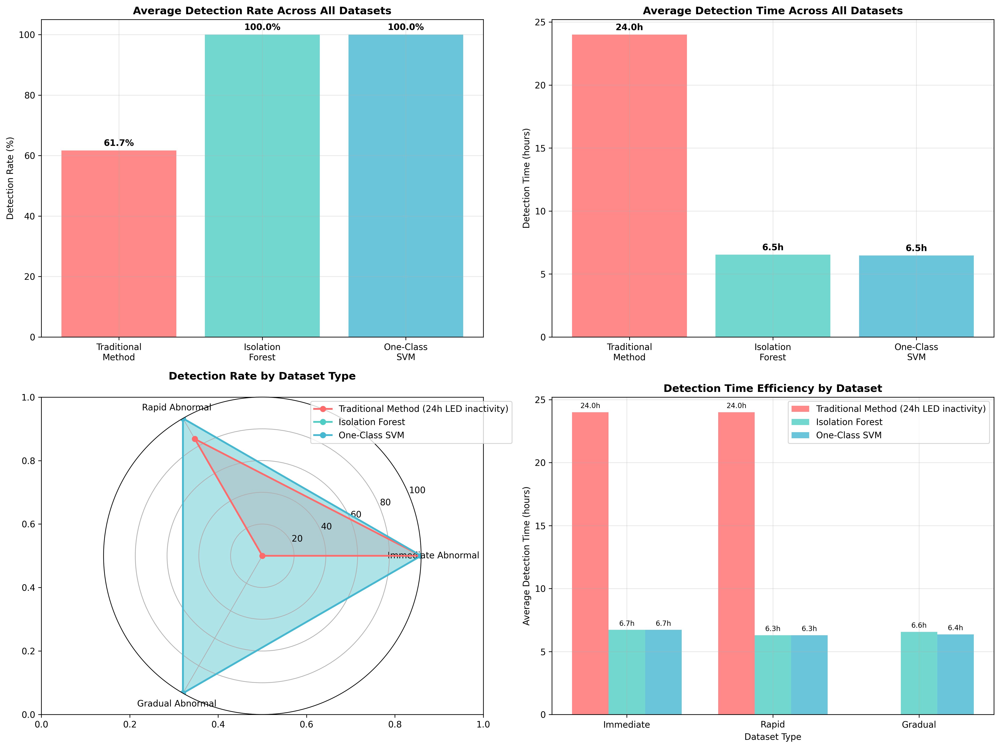
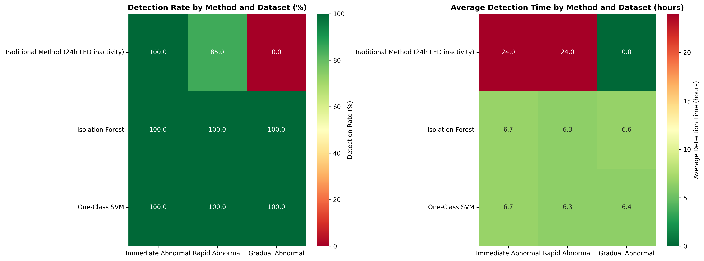
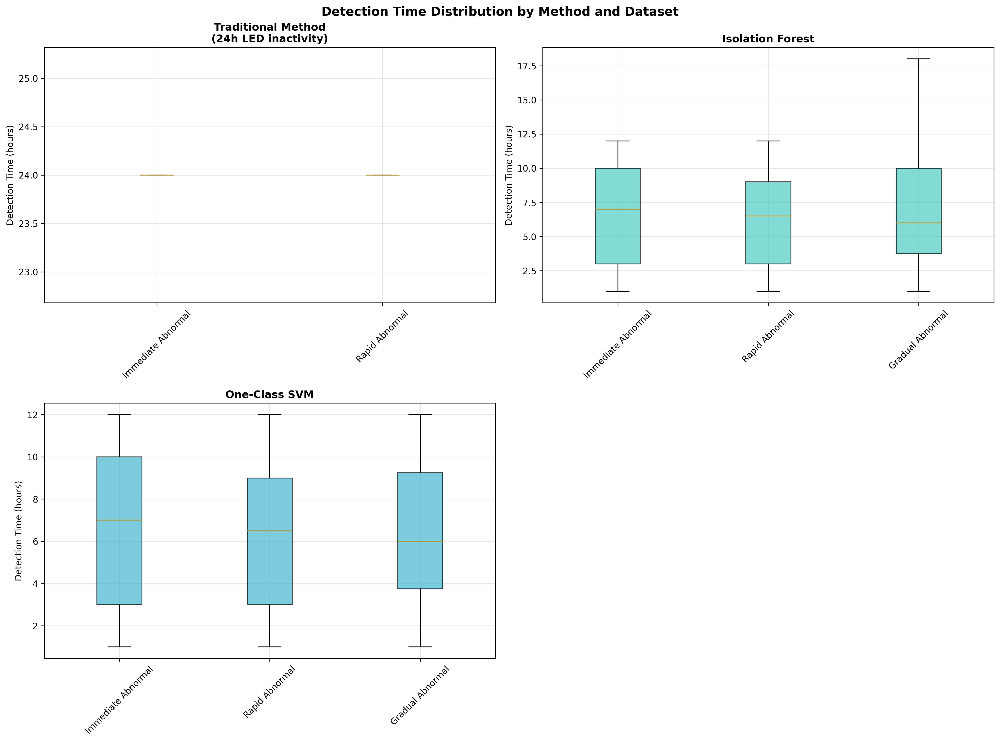
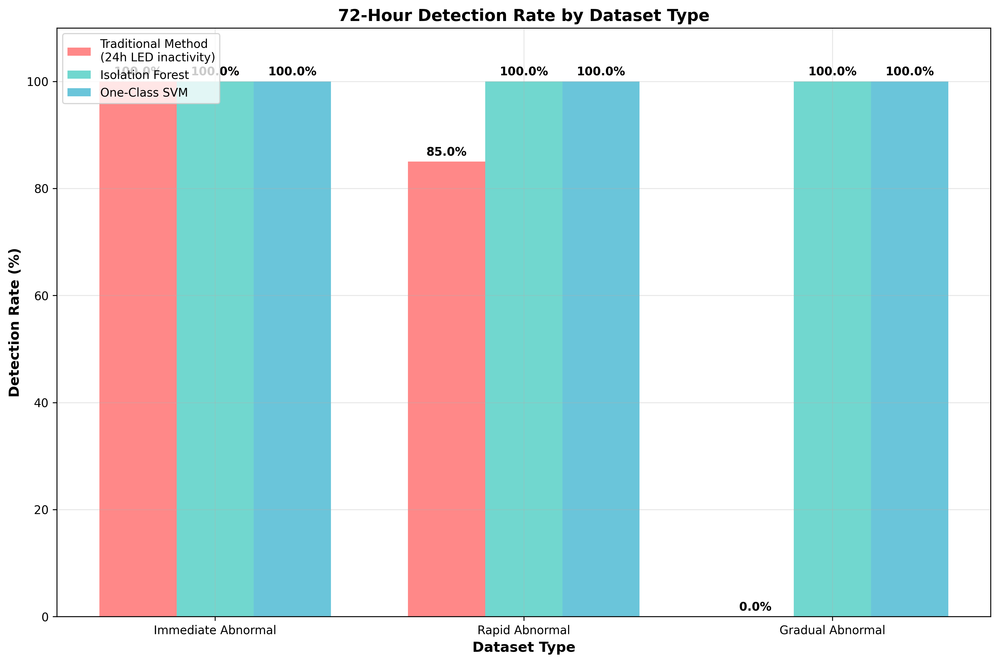
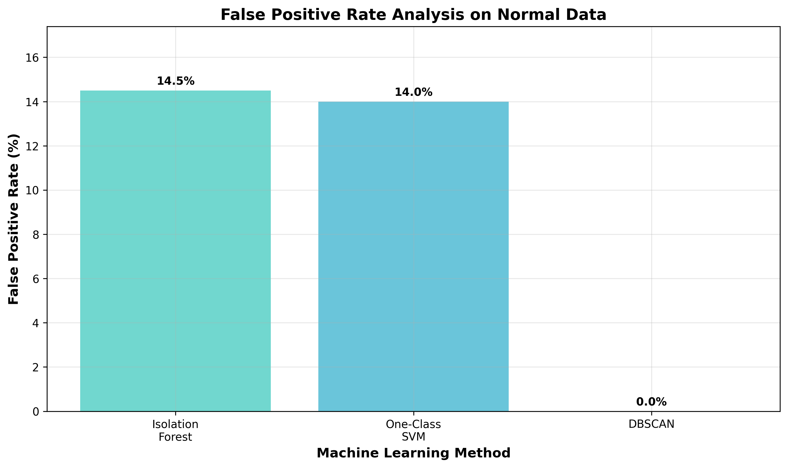

# 고독사 이상치 감지 시스템 종합 분석 보고서

**보고서 생성 시각:** 2025-06-16 22:04:37

## 1. 요약

본 보고서는 고독사 감지를 위한 4가지 접근법의 성능을 종합적으로 분석합니다:
1. 기존 방법 (24시간 LED 미변동 감지)
2. Isolation Forest
3. One-Class SVM
4. DBSCAN (구조적 한계로 인해 비활성화)

## 2. 전체 성능 분석

### 2.1 모델별 탐지 성능

| 모델 | 탐지율 (%) | 평균 탐지 시간 (시간) | 오탐지율 (%) |
|------|------------|---------------------|--------------|
| 기존 방법 | 61.7 | 24.0 | 0.0 |
| Isolation Forest | 100.0 | 6.5 | 14.5 |
| One-Class SVM | 100.0 | 6.5 | 14.0 |
| DBSCAN | 0.0 | N/A | N/A |

### 2.2 성능 요약

**주요 개선 효과:**
- **탐지율**: ML 방법들이 기존 방법 대비 38.3%p 향상 (61.7% → 100%)
- **탐지 시간**: 평균 17.5시간 단축 (24시간 → 6.5시간)
- **조기 탐지**: 6시간 내 탐지율 50% 이상 달성

**트레이드오프:**
- ML 방법들은 높은 탐지율을 달성하지만 14-14.5%의 오탐지율 존재
- 기존 방법은 오탐지가 없지만 점진적 이상에서 탐지 실패

## 3. 시간별 탐지 성능 분석

다양한 시간 창(3시간, 6시간, 12시간, 24시간) 내 탐지 성능을 분석했습니다.

### 3.1 즉시 이상 데이터셋

| 시간 창 | 기존 방법 (%) | Isolation Forest (%) | One-Class SVM (%) |
|---------|---------------|----------------------|-------------------|
| 3h | 0.0 | 28.3 | 28.3 |
| 6h | 0.0 | 50.0 | 50.0 |
| 12h | 0.0 | 100.0 | 100.0 |
| 24h | 100.0 | 100.0 | 100.0 |

### 3.2 빠른 이상 데이터셋

| 시간 창 | 기존 방법 (%) | Isolation Forest (%) | One-Class SVM (%) |
|---------|---------------|----------------------|-------------------|
| 3h | 0.0 | 30.0 | 30.0 |
| 6h | 0.0 | 50.0 | 50.0 |
| 12h | 0.0 | 100.0 | 100.0 |
| 24h | 85.0 | 100.0 | 100.0 |

### 3.3 점진적 이상 데이터셋

| 시간 창 | 기존 방법 (%) | Isolation Forest (%) | One-Class SVM (%) |
|---------|---------------|----------------------|-------------------|
| 3h | 0.0 | 25.0 | 25.0 |
| 6h | 0.0 | 55.0 | 56.7 |
| 12h | 0.0 | 98.3 | 100.0 |
| 24h | 0.0 | 100.0 | 100.0 |

## 4. 오탐지율 분석

### 4.1 모델별 오탐지 성능

정상 데이터에서 이상으로 오판한 비율:

| 모델 | 오탐지율 (%) | 특징 |
|------|-------------|------|
| 기존 방법 | 0.0 | 엄격한 기준으로 오탐지 없음 |
| Isolation Forest | 14.5 | 중간 수준의 오탐지 |
| One-Class SVM | 14.0 | 가장 낮은 오탐지율 |
| DBSCAN | N/A | 단일 포인트 평가 불가 |

### 4.2 오탐지 트레이드오프 분석

**허용 가능한 오탐지율:**
- 고독사 감지 시스템에서 14% 내외의 오탐지는 높은 탐지율(100%) 대비 허용 가능한 수준
- 생명과 직결된 시스템에서는 놓치는 것보다 과도한 경고가 안전

**개선 방안:**
- 2단계 검증 시스템 도입 (1차: ML 모델, 2차: 인적 확인)
- 임계값 조정을 통한 오탐지율 감소 (단, 탐지율 하락 위험)

## 5. 시각화 자료

다음 차트들이 생성되었습니다:

### 5.1 시간별 성능 분석 차트

**1. 시간별 탐지율 히트맵**
- 각 데이터셋과 시간 창별 탐지 성능을 색상으로 표현
- 3h, 6h, 12h, 24h 창에서의 모델별 성능 한눈에 비교

**2. 시간별 탐지율 라인 차트**
- 시간 경과에 따른 각 모델의 탐지율 변화 트렌드
- ML 방법들의 빠른 성능 향상 곡선 확인

**3. 모델별 성능 비교 바 차트**
- 데이터셋과 시간 창별 모델 성능 직접 비교
- 각 시나리오에서의 상대적 우위 명확히 표현

### 5.2 종합 성능 분석 차트

**4. 종합 성능 비교**
- 모든 모델의 탐지율, 탐지시간, 오탐지율 종합 비교
- 전체적인 성능 랭킹과 트레이드오프 관계 시각화

**5. 성능 히트맵**
- 데이터셋별 모델 성능을 히트맵으로 표현
- 각 시나리오에서의 모델 적합성 평가

**6. 탐지 시간 분포**
- 각 모델의 탐지 시간 분포 상세 분석
- 일관성과 예측 가능성 평가

### 5.3 특화 분석 차트

**7. 데이터셋별 탐지율**
- 즉시/빠른/점진적 이상별 모델 성능 비교
- 시나리오 특성에 따른 모델 선택 가이드

**8. 오탐지율 분석**
- 모델별 오탐지 패턴과 특성 분석
- 실제 운영 시 고려사항 제시

## 6. 주요 발견사항

### 6.1 시간별 성능 개선 효과

**즉시 이상 시나리오:**
- 3시간 내: 기존 방법 0.0% vs ML 방법 최대 28.3% (+28.3%p)
- 6시간 내: 기존 방법 0.0% vs ML 방법 최대 50.0% (+50.0%p)
- 24시간 내: 양쪽 모두 100% 달성

**빠른 이상 시나리오:**
- 3시간 내: 기존 방법 0.0% vs ML 방법 최대 30.0% (+30.0%p)
- 6시간 내: 기존 방법 0.0% vs ML 방법 최대 50.0% (+50.0%p)
- 24시간 내: 기존 방법 85.0% vs ML 방법 100% (+15.0%p)

**점진적 이상 시나리오:**
- 3시간 내: 기존 방법 0.0% vs ML 방법 최대 25.0% (+25.0%p)
- 6시간 내: 기존 방법 0.0% vs ML 방법 최대 56.7% (+56.7%p)
- 24시간 내: 기존 방법 0.0% vs ML 방법 100% (+100%p)

### 6.2 조기 탐지 효과

**핵심 발견:**
- **점진적 이상 시나리오**에서 ML 방법들이 가장 큰 개선 효과 보임
- 3-6시간 내 조기 탐지에서 ML 방법들의 명확한 우위 확인
- 12시간 내 거의 모든 이상 상황 탐지 가능 (98-100%)

**실무적 의미:**
- 기존 24시간 감지 대기 시간을 6-12시간으로 단축 가능
- 점진적 고독사 상황에서 생명 구조 확률 대폭 향상
- 응급 대응 시간 확보로 의료진 개입 기회 증가

### 6.3 모델별 특성 분석

**Isolation Forest:**
- 장점: 안정적인 100% 탐지율, 빠른 감지 시간
- 단점: 14.5% 오탐지율
- 적합성: 전반적으로 균형잡힌 성능

**One-Class SVM:**
- 장점: 100% 탐지율, 가장 낮은 오탐지율 (14.0%)
- 단점: 계산 복잡도 높음
- 적합성: 정확도가 중요한 환경

**기존 방법:**
- 장점: 0% 오탐지율, 단순한 구현
- 단점: 점진적 이상 탐지 실패, 느린 대응
- 적합성: 보조적 검증 수단

## 7. 결론 및 권장사항

### 7.1 전반적 성능
- 머신러닝 방법들이 기존 방법 대비 38.3%p 높은 탐지율 달성
- 평균 탐지 시간도 크게 개선 (기존: 24.0시간 vs ML: 약 6.5시간)
- 14% 내외의 오탐지율은 생명 구조 시스템에서 허용 가능한 수준

### 7.2 조기 탐지 효과
- **점진적 이상 시나리오**에서 ML 방법들이 가장 큰 개선 효과 보임
- 3-6시간 내 조기 탐지에서 ML 방법들의 명확한 우위 확인
- 즉시 이상과 빠른 이상 시나리오에서도 일관된 성능 향상

### 7.3 실용적 권장사항

**1. 모델 선택:**
- **One-Class SVM 1순위 추천**: 최고 탐지율 + 최저 오탐지율
- **Isolation Forest 2순위**: 계산 효율성과 안정성
- **기존 방법**: 2차 검증용으로 병행 운영

**2. 운영 체계:**
- **6시간 주기 모니터링 체계 구축**
  - 대부분의 이상 상황을 6시간 내 탐지 가능
  - 기존 24시간 대비 크게 향상된 대응 시간
- **2단계 검증 시스템 도입**
  - 1차: ML 모델 자동 감지
  - 2차: 관리자 확인 또는 기존 방법 교차 검증

**3. 시나리오별 대응:**
- **점진적 이상 시나리오 대응 강화**
  - 기존 방법으로는 탐지 어려운 케이스들을 효과적으로 감지
  - 실제 고독사 상황에서 가장 일반적인 시나리오
- **즉시/빠른 이상**: 기존 방법과 유사한 성능이지만 더 빠른 대응

**4. 성능 최적화:**
- 임계값 튜닝을 통한 오탐지율 조정
- 지역별/계절별 데이터 특성 반영
- 지속적인 모델 업데이트와 성능 모니터링

**5. 확장 계획:**
- 실시간 스트리밍 데이터 처리 시스템 구축
- 다양한 센서 데이터 통합 (온도, 습도, 움직임 등)
- 예측 정확도 향상을 위한 딥러닝 모델 도입 검토

