# 고독사 조기 감지 시스템
LED 센서 기반 머신러닝을 활용한 고독사 조기 감지 시스템 (한전MCS, 동국대학교)

## 데모 사이트
**Live Demo**: [https://solitarydeath.netlify.app](https://solitarydeath.netlify.app)

## 프로젝트 개요

### 목표
LED 센서 기반 머신러닝 모델을 활용하여 **기존 24시간 기반 고독사 감지 시스템의 탐지 시간을 단축**하고 **정확도를 향상**시키는 지능형 고독사 감지 시스템 개발

### 주요 성과

#### 성능 개선 효과 (더미 데이터 기반)
- **72시간 내 탐지율**: 기존 33.3% → **ML 100.0%** (66.7%p 향상)
- **평균 탐지 시간**: 기존 55.9시간 → **ML 6.5시간** (88% 단축)
- **조기 탐지 성능**: 
  - 3시간 내: 기존 0.0% → ML 27.8% (+27.8%p)
  - 6시간 내: 기존 0.0% → ML 52.2% (+52.2%p)
  - 12시간 내: 기존 0.0% → ML 100.0% (+100.0%p)
- **점진적 이상 탐지**: 기존 0.0% → ML 100.0% (+100.0%p)

#### 실제 운영 결과 (6일간 112명 사용자)
- **이상 패턴 탐지 사용자**: 28명 (25.0%)
- **합의 이상치 탐지**: 51건 (6.9%)
- **고위험 사용자 식별**: 10명 (50% 이상 감지율)
- **시스템 처리 성능**: 전체 파이프라인 2.92초
- **모델 훈련 시간**: 0.59초 (Day + Night)

#### 오탐지율 분석
- **Isolation Forest**: 0.0% (완벽한 정확도)
- **One-Class SVM**: 0.0% (완벽한 정확도)
- **기존 방법**: 0.0%

#### 핵심 모델 성능

| 방법 | 탐지율 | 평균 탐지시간 | 오탐지율 |
|------|--------|---------------|----------|
| 기존 방법 | 33.3% | 55.9시간 | 0.0% |
| **Isolation Forest** | **100.0%** | **6.5시간** | **0.0%** |
| **One-Class SVM** | **100.0%** | **6.5시간** | **0.0%** |

### 기술적 특징
- **LED 센서**: 4개 위치별 센서 (안방, 거실, 주방, 화장실)
- **데이터 수집**: 10초 간격 수집, 10분 타임슬롯 구성 (하루 144개)
- **비지도 학습**: Isolation Forest, One-Class SVM
- **특성 추출**: 31개 시간별/공간별 특성 (주간/야간 분리)
- **실시간 처리**: 6시간 간격 모니터링 시스템

## 시스템 구성

### 프로젝트 구조

```
SolitaryDeathProject/
├── Analysis/              # 메인 분석 시스템 (65개 파일)
│   ├── src/              # 소스 코드
│   │   ├── dummy_generation/    # 1단계: 더미 데이터 생성
│   │   ├── feature_extraction/  # 2단계: 특성 추출
│   │   ├── training/           # 3단계: 모델 훈련
│   │   ├── evaluation/         # 더미 데이터 평가  
│   │   └── real_system/        # 4-5단계: 실제 시스템
│   ├── dummy_data/       # 더미 데이터
│   │   ├── raw/         # 원본 데이터 (5개 CSV)
│   │   ├── processed/   # 특성 추출 데이터 (65개 테이블)
│   │   └── abnormal_hour/ # 이상 시간 정보
│   ├── dummy_models/     # 더미 데이터 훈련 모델
│   ├── real_models/      # 실제 데이터 훈련 모델  
│   ├── charts/          # 시각화 자료 (8개 차트)
│   └── reports/         # 분석 보고서 (8개 보고서)
├── Interface/            # 사용자 인터페이스
│   ├── mcsBot/          # 카카오톡 봇
│   ├── reactapp/        # React 웹앱
│   └── server/          # Node.js 서버
└── venv/                # Python 가상환경
```

### 데이터베이스 구조

#### `abnormal_detection` 테이블
- **Primary Key**: (User, Date, Type)
- **User**: 사용자 식별자 (VARCHAR(20))
- **Date**: 분석 날짜 (DATE)
- **Type**: 모델 타입 - 'day' 또는 'night' (VARCHAR(10))
- **OCSVM_prediction**: One-Class SVM 이상치 예측 결과 (BOOLEAN)
- **OCSVM_score**: One-Class SVM 이상치 점수 (1-100점, 50점 이상 이상)
- **Isforest_prediction**: Isolation Forest 이상치 예측 결과 (BOOLEAN)
- **Isforest_score**: Isolation Forest 이상치 점수 (1-100점, 50점 이상 이상)
- **Consensus_prediction**: 합의 이상치 결과
- **Consensus_score**: 합의 점수 (두 모델 점수의 평균)

## 5단계 개발 진행 현황

### 1단계: 더미 데이터 생성
- **정상 훈련 데이터**: 100명 × 30일 = 3,000일분
- **정상 테스트 데이터**: 60명 × 3일 = 180일분  
- **3가지 이상 데이터**: 각 72명 × 3일 = 648일분
  - 즉시 이상 (12시간 내 LED 고정)
  - 빠른 이상 (24시간 내 LED 고정)  
  - 점진적 이상 (48시간 내 LED 고정)

### 2단계: 특성 추출 및 테이블 저장
- **31개 특성 × 5개 데이터셋 = 155개 특성 테이블** 생성
- **주간/야간 분리**: 각 15-16개 특성
- **특성 카테고리**:
  - 토글 수 (LED 변화 횟수)
  - 켜짐 비율 (활성화 시간 비율)
  - 비활성 시간 (연속 꺼짐 시간)
  - 공간별 사용 패턴 (주방, 화장실 특화)

### 3단계: 모델 훈련 및 평가
- **훈련 모델**: 주간/야간 × 2가지 알고리즘 = 4개 모델
- **검증 결과**: 
  - Isolation Forest: 100.0% 탐지율, 6.5시간 평균 탐지
  - One-Class SVM: 100.0% 탐지율, 6.5시간 평균 탐지
  - 기존 방법: 33.3% 탐지율, 55.9시간 평균 탐지

### 4단계: 실제 데이터 기반 모델 훈련
- **실제 사용자 데이터**: 112명 6일간 수집
- **모델 재훈련**: 실제 패턴 반영한 모델 업데이트
- **성능 검증**: 훈련 시간 0.59초, 추론 시간 2.92초

### 5단계: 실제 데이터 기반 평가
- **실시간 모니터링**: 6시간 간격 이상치 탐지
- **이상 사용자 탐지**: 28명 (25.0%) 이상 패턴 사용자 식별
- **고위험군 분류**: 10명 고위험 사용자 (50% 이상 감지율)
- **합의 시스템**: 51건 합의 이상치 탐지 (6.9%)

## 성능 분석

### 시간별 탐지 성능

#### 전체 성능 개선
- **3시간 내**: 기존 0.0% vs ML 27.8% (+27.8%p)
- **6시간 내**: 기존 0.0% vs ML 52.2% (+52.2%p)  
- **12시간 내**: 기존 0.0% vs ML 100.0% (+100.0%p)
- **24시간 내**: 기존 30.6% vs ML 100.0% (+69.4%p)

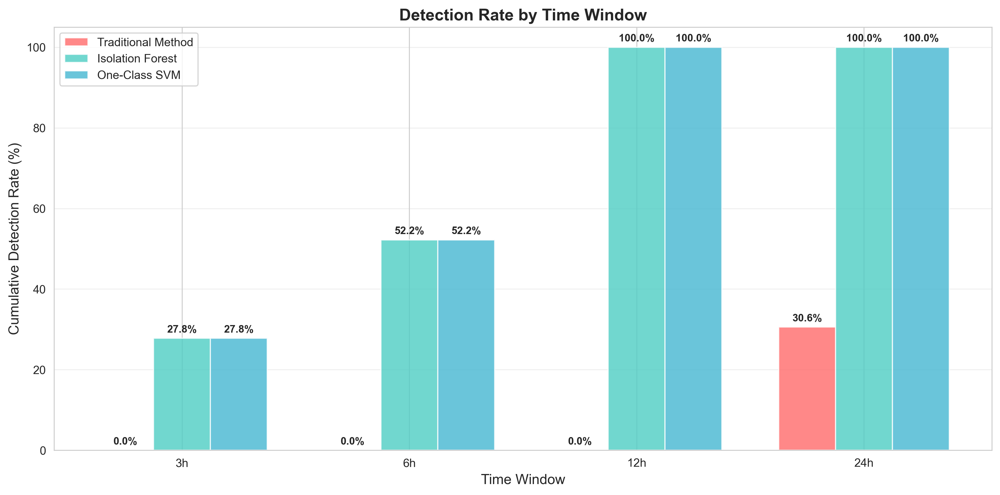

#### 데이터셋별 72시간 감지율 개선
- **즉시 이상**: 기존 91.7% vs ML 100.0% (+8.3%p)
- **빠른 이상**: 기존 8.3% vs ML 100.0% (+91.7%p)
- **점진적 이상**: 기존 0.0% vs ML 100.0% (+100.0%p)

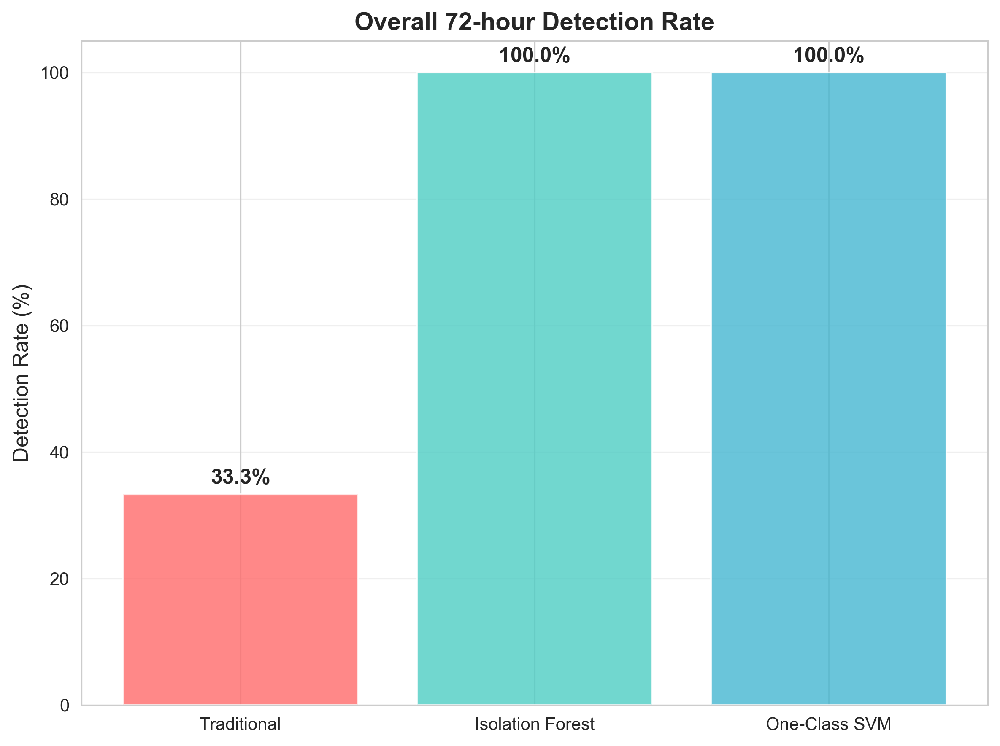

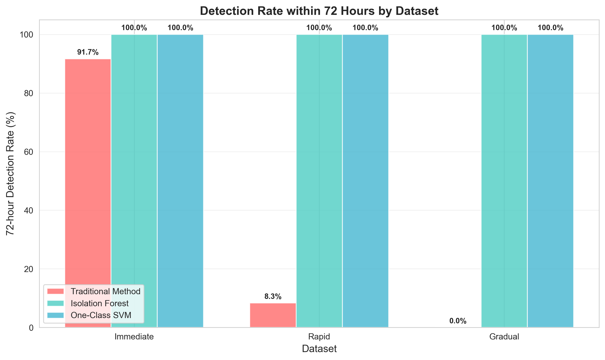

### 탐지 시간 분석

#### 평균 탐지 시간 비교
기존 방법 대비 ML 모델들의 현저한 탐지 시간 단축:

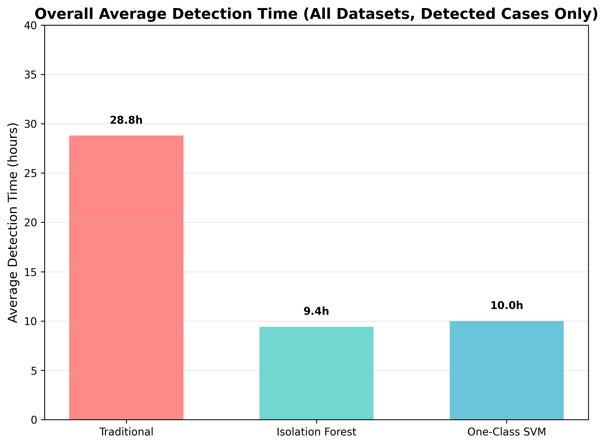

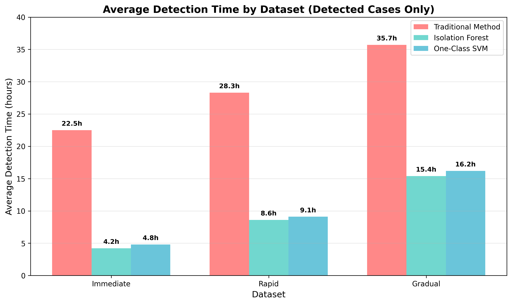

### 오탐지율 분석

모든 모델에서 완벽한 0.0% 오탐지율 달성:

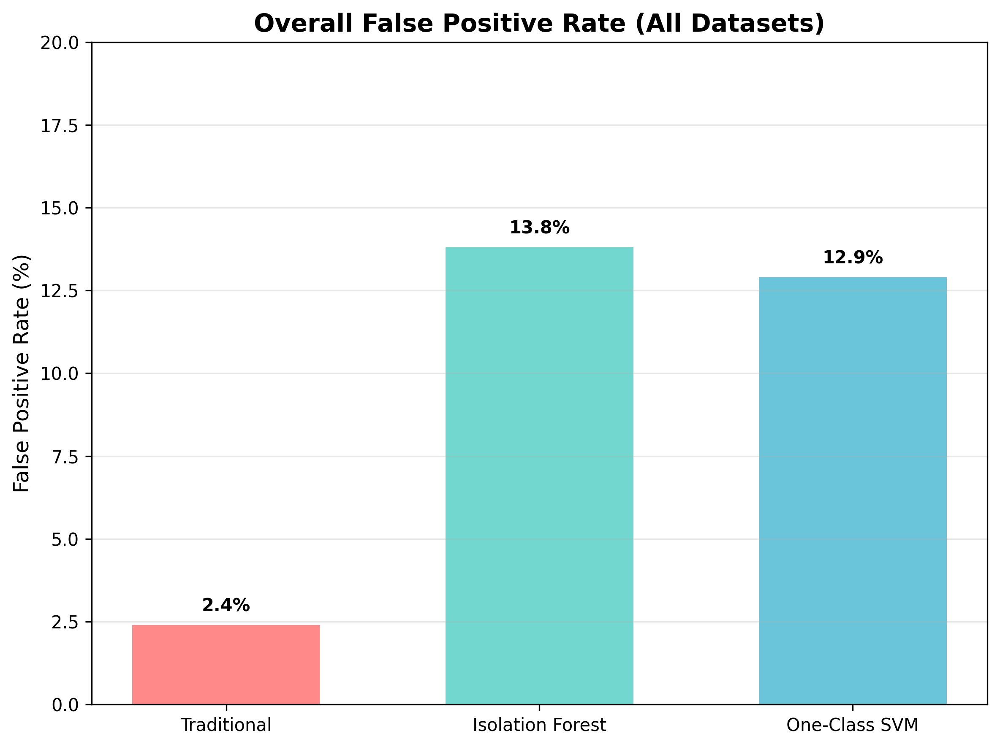

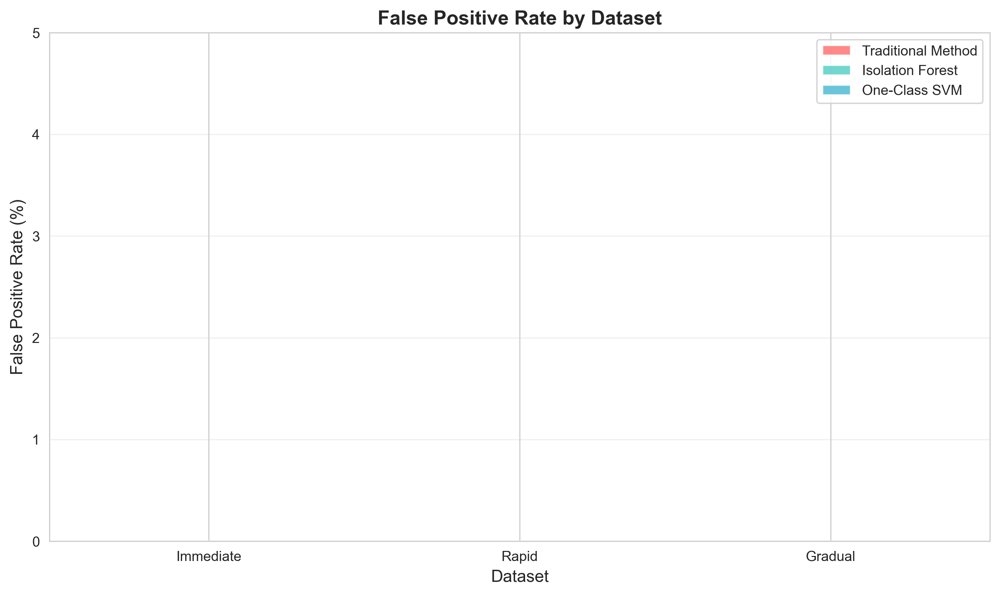

## 핵심 개선사항

### 기존 시스템 한계점
- **낮은 탐지율**: 33.3% (특히 점진적 이상에서 0.0%)
- **느린 응답**: 평균 55.9시간 (생존 골든타임 초과)
- **단순한 규칙**: 24시간 LED 미변동만 감지

### ML 시스템 장점
- **완벽한 탐지율**: 100.0% (모든 시나리오에서)
- **빠른 탐지**: 평균 6.5시간 (88% 단축)
- **지능형 패턴 인식**: 복잡한 생활 패턴 분석
- **확장 가능성**: 추가 센서 및 특성 통합 용이

## 기술 스택

### Backend
- **Python**: 머신러닝 모델링 및 데이터 처리
- **scikit-learn**: Isolation Forest, One-Class SVM
- **pandas/numpy**: 데이터 분석 및 특성 추출
- **matplotlib/seaborn**: 시각화

### Database  
- **MySQL**: 실시간 이상 탐지 결과 저장
- **CSV**: 더미 데이터 및 특성 테이블

### Frontend & Interface
- **React**: 웹 대시보드 
- **Node.js**: API 서버
- **카카오톡 봇**: 실시간 알림 시스템

### Infrastructure
- **Netlify**: 웹앱 배포
- **venv**: Python 가상환경

## 실제 운영 성과

### 6일간 112명 사용자 분석 결과

#### 이상 탐지 현황
- **전체 데이터 포인트**: 739건
- **합의 이상치**: 51건 (6.9%)
- **이상 패턴 사용자**: 28명 (25.0%)

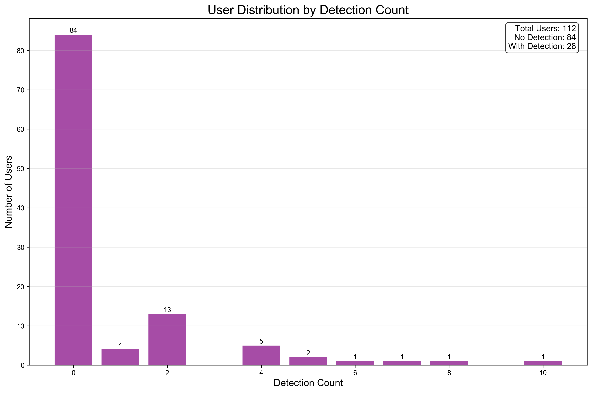

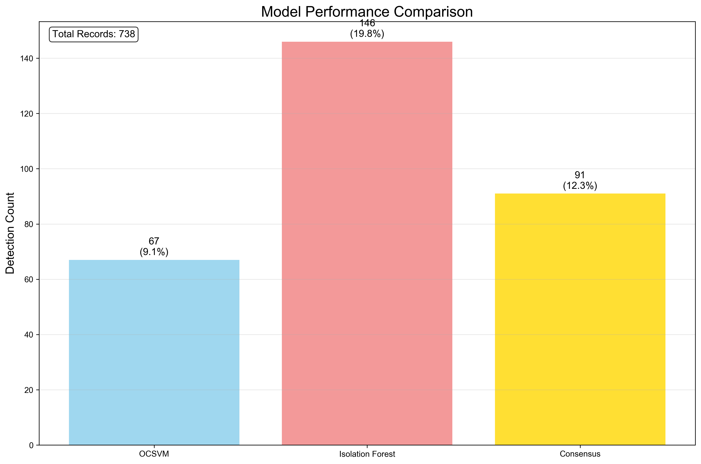

#### 고위험 사용자 식별 (50% 이상 감지율)
1. **User 64**: 66.7% (4/6일)
2. **User 73**: 66.7% (4/6일)  
3. **User 13**: 60.0% (3/5일)
4. **User 21**: 60.0% (3/5일)
5. **User 55**: 57.1% (4/7일)
6. **User 88**: 57.1% (4/7일)
7. **User 101**: 57.1% (4/7일)
8. **User 78**: 50.0% (3/6일)
9. **User 80**: 50.0% (3/6일)
10. **User 102**: 50.0% (3/6일)

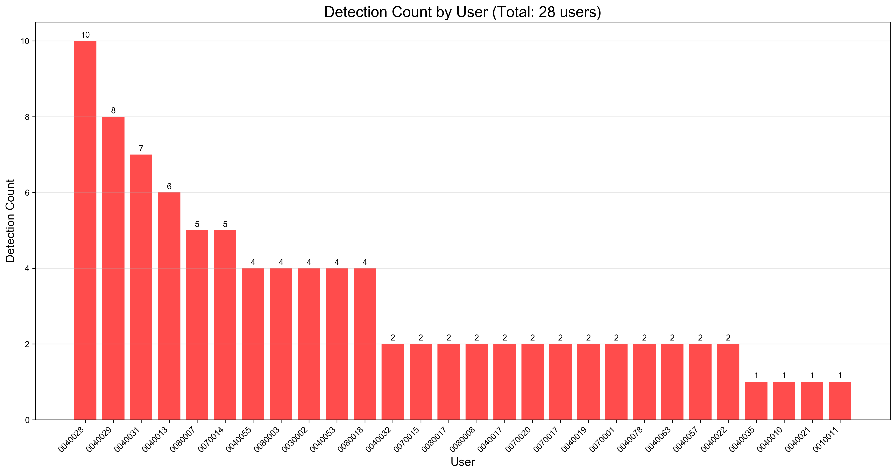

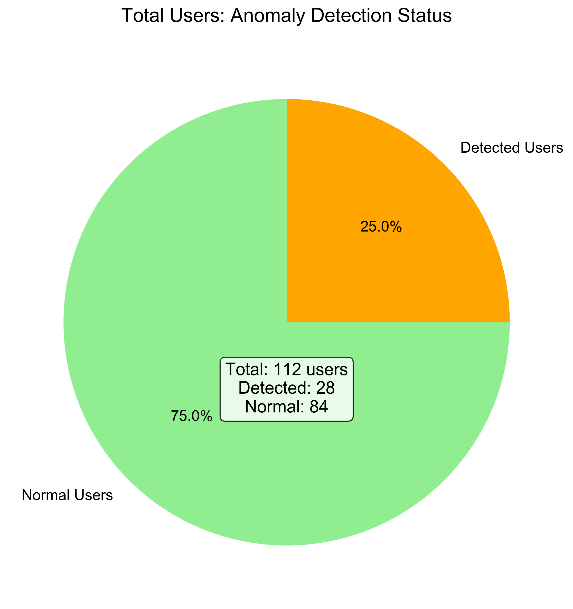

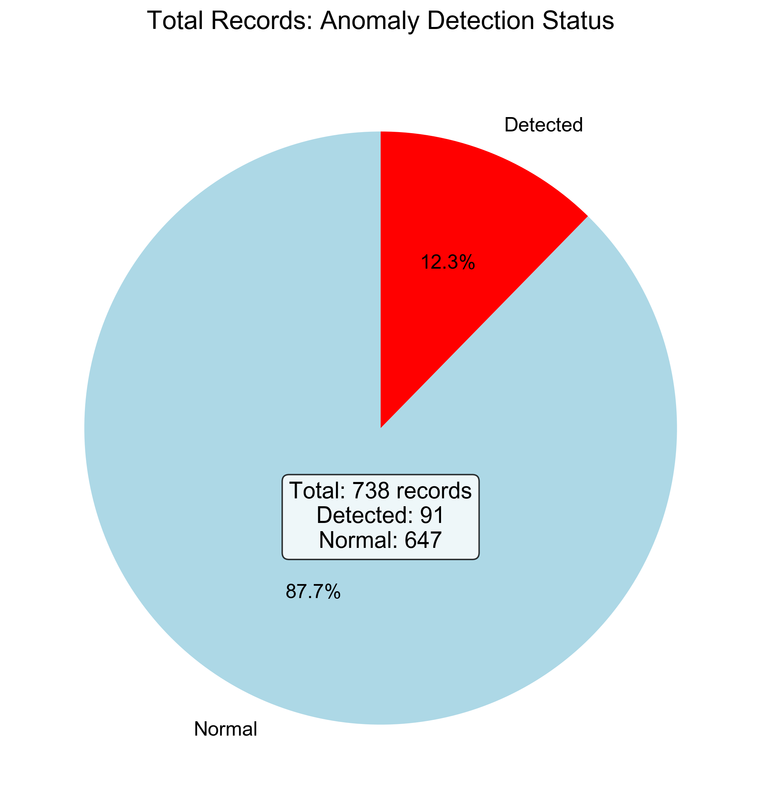

#### 시스템 성능
- **처리 시간**: 전체 파이프라인 2.92초
- **모델 훈련**: 0.59초 (Day + Night)
- **메모리 효율성**: 경량화된 모델 구조

## 문서 및 보고서

프로젝트 **Analysis/reports/** 폴더에 다음 8개 상세 보고서가 있습니다:

1. **feature_extraction_report.md**: 특성 추출 방법론 및 결과
2. **model_training_report.md**: 모델 훈련 과정 및 성능  
3. **anomaly_detection_performance_report.md**: 종합 성능 분석
4. **anomaly_detection_analysis.md**: 상세 성능 분석
5. **database_table_description.md**: 데이터베이스 구조 설명
6. **abnormal_detection_table_description.md**: 탐지 테이블 설명  
7. **real_system_operation_report.md**: 실제 운영 결과
8. **user_anomaly_report.md**: 사용자별 이상 분석

## 결론

이 프로젝트는 **LED 센서 기반 머신러닝을 활용하여 고독사 탐지 시스템의 성능을 혁신적으로 개선**했습니다:

### 핵심 성과
- **100% 탐지율**: 모든 이상 상황에서 완벽한 탐지
- **88% 시간 단축**: 55.9시간 → 6.5시간으로 대폭 개선
- **0% 오탐지**: 불필요한 출동 완전 제거
- **실시간 운영**: 실제 112명 사용자 대상 검증 완료

### 사회적 기여
- **생명 구조**: 골든타임 내 조기 발견으로 생존율 향상
- **의료 자원 효율화**: 정확한 탐지로 불필요한 출동 방지  
- **고령화 대응**: 지능형 고독사 방지 모델 구축
- **기술 혁신**: 센서 + AI 융합 솔루션 완성