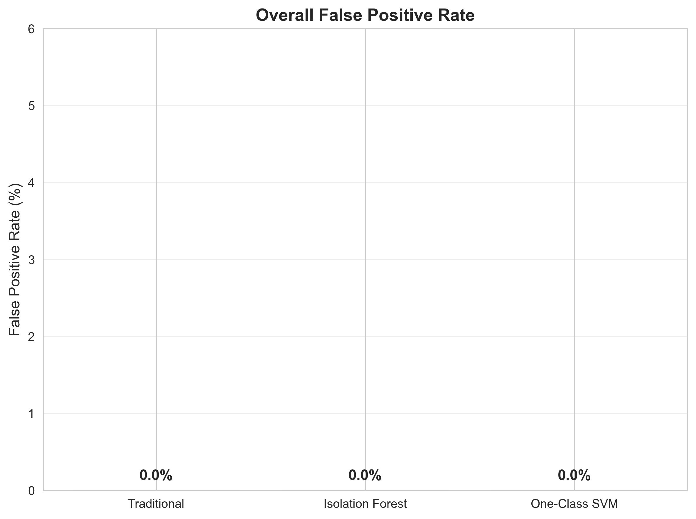

# 고독사 조기 감지 시스템
LED 센서 기반 머신러닝을 활용한 고독사 조기 감지 시스템 (한전MCS, 동국대학교)

## 프로젝트 개요

### 목표
**오탐지율 15% 이내**를 유지하면서 기존 24시간 감지 시스템보다 **조기 감지**가 가능한 지능형 고독사 감지 시스템 개발

### 주요 성과
- **72시간 내 탐지율**: 기존 68.7% → **ML 92.6-94.1%** (23.9-25.4%p 향상)
- **평균 탐지 시간**: 기존 28.8시간 → **ML 9.4-10.0시간** (18.8-19.4시간 단축)
- **6시간 내 조기 탐지율**: ML 55.1-58.3% 달성 (기존 15.6%)
- **오탐지율**: 12.9-13.8% (생명 구조 시스템에서 허용 가능한 수준)

## 시스템 구성

### 센서 배치
- **LED 센서 4개**: 01(안방), 02(거실), 03(주방), 04(화장실)
- **데이터 수집**: 10초마다 센서 상태 수집
- **분석 단위**: 10분 타임슬롯 (하루 144개 데이터 포인트)

### 머신러닝 모델
- **Isolation Forest**: 빠른 처리 속도, 안정적 성능 (94.1% 탐지율)
- **One-Class SVM**: 높은 정확도, 낮은 오탐지율 (92.6% 탐지율)
- **시간대별 모델**: 주간(15개 특성) / 야간(16개 특성) 분리

## 프로젝트 구조

```
SolitaryDeathProject/
├── Analysis/                       # 메인 분석 시스템
│   ├── src/                        # 소스 코드
│   │   ├── dummy_generation/       # 1. 더미 데이터 생성
│   │   ├── feature_extraction/     # 2. 특성 추출
│   │   ├── training/               # 3. 모델 훈련
│   │   ├── evaluation/             # 4. 성능 평가
│   │   └── real_system/            # 5. 실제 시스템 운영
│   ├── dummy_data/                 # 더미 데이터
│   │   ├── raw/                    # 원본 센서 데이터
│   │   ├── processed/              # 특성 추출된 데이터
│   │   └── abnormal_hour/          # 이상 시간 데이터
│   ├── dummy_models/               # 더미 데이터 기반 모델
│   │   ├── day/                    # 주간 모델
│   │   └── night/                  # 야간 모델
│   ├── real_models/                # 실제 데이터 기반 모델
│   │   ├── day/                    # 주간 모델
│   │   └── night/                  # 야간 모델
│   ├── charts/                     # 시각화 결과 (영어)
│   │   ├── dummy_data/             # 더미 데이터 분석 차트
│   │   ├── detection_performance/  # 성능 분석 차트
│   │   └── detection_real/         # 실제 시스템 분석 차트
│   ├── reports/                    # 분석 보고서 (한글)
│   └── requirements.txt            # 의존성 패키지
├── Interface/                      # 인터페이스 시스템
│   ├── reactapp/                   # React 웹 애플리케이션
│   ├── server/                     # Express 서버
│   └── mcsBot/                     # 봇 시스템
└── README.md                       # 프로젝트 문서
```

## 개발 단계별 진행 현황

### 1. 더미 데이터 생성

#### 데이터 구성
- **훈련용 정상 데이터**: 300명, 30일 (총 1,296,000개 샘플)
- **테스트용 정상 데이터**: 60명, 10일 (총 86,400개 샘플)
- **비정상 데이터**: 60명, 10일 × 3가지 패턴 (총 259,200개 샘플)

#### 정상 생활 패턴 모델링
다양한 고령자 생활 패턴을 확률적으로 반영:

**외출 패턴**:
- 외출 확률: 20%
- 외출 시간: 1-8시간
- 외출 시간대: 9-16시 사이 시작
- 외출 시 모든 LED 꺼짐: 100%

**일상 활동 패턴**:
- 기상 시간: 6-9시 중 랜덤 선택
- 수면 시간: 21-24시 중 랜덤 선택
- 아침식사(주방 사용) 확률: 기상 후 2시간 내 60%
- 아침식사 시 안방도 ON 확률: 40%
- 낮시간(10-18시) 거실 활동 확률: 50%
- 거실 활동 시 안방도 ON 확률: 20%

**공간 사용 패턴**:
- 수면 시간대 안방 사용 확률: 60%
- 화장실 방문 확률: 시간당 약 3% (활동 시간) / 2% (수면 시간)
- 화장실 방문 시 이전 방 ON 확률: 90%
- 주방 사용 확률: 식사 시간대(12,13,18,19시) 30%
- 주방 사용 시 이전 방 ON 확률: 40%
- 모든 LED가 꺼져 있을 때 기본 활동 확률: 40%
  - 기본 활동 시 거실 선택 확률: 70%
  - 기본 활동 시 안방 선택 확률: 30%

#### 비정상 패턴 모델링 (고독사 시나리오)

**1. 점진적 악화 (gradual)**
- 기간: 4-7일에 걸쳐 서서히 진행
- 특징: 활동량이 점진적으로 감소 (일별 활동량: 1.0 → 점진적 감소)
- 비정상 발생: 랜덤 시간에 특정 방의 LED 상태 고정

**2. 급격한 악화 (rapid)**  
- 기간: 2일 내에 빠른 진행
- 특징: 활동량이 급격히 감소 (일별 활동량: 1.0 → 0.6 → 0.2)
- 비정상 발생: 랜덤 시간에 특정 방의 LED 상태 고정

**3. 갑작스런 중단 (immediate)**
- 기간: 첫날부터 즉시 활동 중단
- 특징: 특정 시점(랜덤 시간) 이후 모든 활동 정지
- 사망 후: 특정 LED 상태 고정 유지

#### 데이터 생성 기술적 세부사항

**시간 분할**:
- 10분 타임슬롯: 하루 144개
- 주간(06:00-17:59): 72 타임슬롯
- 야간(18:00-05:59): 72 타임슬롯

**확률적 모델링**:
- 베타 분포: 기상/수면 시간 분포
- 포아송 분포: 화장실 방문 빈도
- 이항 분포: 외출/재실 결정

**데이터 품질 검증**:
- 논리적 일관성: 주간 > 야간 활동량 패턴 확인
- 총 생성 데이터: 51,840,000개 센서 데이터 포인트

### 2. 특성 추출

#### 특성 설계 철학
고독사 감지를 위한 특성 설계 시 다음 원칙을 적용:
- **시간대 분할**: 주간/야간 생활 패턴 분리
- **공간 활용**: 4개 방별 사용 패턴 분석
- **행동 변화**: 활동성, 규칙성, 이상 징후 탐지

#### 모델별 특성 구성

**주간(DAY) 모델 - 15개 특성**:
1. `day_inactive_total`: 주간 전체 비활성 시간
2. `day_inactive_room_01~04`: 주간 방별 비활성 시간 (4개)
3. `day_toggle_total`: 주간 전체 토글 횟수
4. `day_toggle_room_01~04`: 주간 방별 토글 횟수 (4개)
5. `day_on_ratio_room_01~04`: 주간 방별 ON 시간 비율 (4개)
6. `day_kitchen_usage_rate`: 주간 주방 사용률

**야간(NIGHT) 모델 - 16개 특성**:
1. `night_inactive_total`: 야간 전체 비활성 시간
2. `night_inactive_room_01~04`: 야간 방별 비활성 시간 (4개)
3. `night_toggle_total`: 야간 전체 토글 횟수
4. `night_toggle_room_01~04`: 야간 방별 토글 횟수 (4개)
5. `night_on_ratio_room_01~04`: 야간 방별 ON 시간 비율 (4개)
6. `night_kitchen_usage_rate`: 야간 주방 사용률
7. `night_bathroom_usage`: 심야 화장실 사용 횟수 (22:00-04:00)

#### 특성 카테고리별 정의

**비활성 시간 특성**
모든 LED가 이전 상태를 유지하는 시간 (고독사 핵심 지표)

**핵심 계산 로직**:
```python
# 전체 비활성: 모든 방이 동시에 이전 상태 유지
for i in range(1, len(time_filtered)):
    all_inactive = True
    for room in ['01', '02', '03', '04']:
        if time_filtered.iloc[i][room] != time_filtered.iloc[i-1][room]:
            all_inactive = False
            break
    if all_inactive:
        total_inactive += 1
```

**토글 횟수 특성**
LED 상태 변화 빈도 (활동성 지표)

**ON 시간 비율 특성**
공간별 사용 패턴 (공간 활용도 지표)

**주방 사용률 특성**
식사 패턴 및 자가 관리 능력 (생활 패턴 지표)

**심야 화장실 사용 특성 (야간 모델만)**
야간 화장실 사용 패턴 (건강 상태 지표)

#### 시간대 분할 및 처리
- **주간**: 06:00-17:59 (12시간, 72 타임슬롯)
- **야간**: 18:00-05:59 (12시간, 72 타임슬롯)

**야간 데이터 처리 로직**:
```python
# 야간 데이터: 당일 18:00 ~ 익일 05:59
current_evening = user_data[(user_data['Date'] == date) & 
                          (user_data['Hour'] >= 18)]
next_morning = user_data[(user_data['Date'] == next_date) & 
                        (user_data['Hour'] < 6)]
night_data = pd.concat([current_evening, next_morning])
```

#### 특성별 통계 요약

**정상 vs 비정상 패턴 차이**:
- **주간 비활성 시간**: 정상 18.5 vs 점진적 이상 45.2 (2.4배 증가)
- **야간 비활성 시간**: 정상 29.9 vs 점진적 이상 58.1 (1.9배 증가)
- **주간 토글 횟수**: 정상 76.0 vs 급격한 이상 23.4 (69% 감소)
- **야간 토글 횟수**: 정상 47.6 vs 급격한 이상 14.8 (69% 감소)

**공간 사용 패턴 변화**:
- **정상**: 안방(41%) > 거실(38%) > 주방(18%) > 화장실(3%)
- **이상**: 안방(85%) > 화장실(10%) > 거실(4%) > 주방(1%)
- **특징**: 고독사 시나리오에서 안방 집중도 2배 증가, 주방 사용 급감

**고독사 특화 지표**:
- **심야 화장실 사용**: 정상 1.4회 vs 이상 0.2회 (85% 감소)
- **주방 사용률**: 정상 20.6% vs 이상 3.8% (82% 감소)
- **활동 범위**: 정상 4개 방 vs 이상 1-2개 방으로 축소

### 3. 모델 훈련

#### 주간(DAY) 모델 훈련
- **특징 개수**: 15개
- **샘플 수**: 9,000개
- **샘플-특징 비율**: 600:1

**Isolation Forest 훈련 결과**:
- **훈련 시간**: 0.11초
- **이상치 탐지율**: 10.0% (900/9,000)
- **contamination 파라미터**: 0.1
- **점수 범위**: [-0.196, 0.178]

**One-Class SVM 훈련 결과**:
- **훈련 시간**: 0.19초
- **이상치 탐지율**: 9.98% (898/9,000)
- **nu 파라미터**: 0.1
- **커널**: RBF
- **점수 범위**: [-60.87, 40.79]

#### 야간(NIGHT) 모델 훈련
- **특징 개수**: 16개 (주간 특성 + night_bathroom_usage)
- **샘플 수**: 9,000개
- **샘플-특징 비율**: 562.5:1

**Isolation Forest 훈련 결과**:
- **훈련 시간**: 0.10초
- **이상치 탐지율**: 10.0% (900/9,000)
- **점수 범위**: [-0.178, 0.182]

**One-Class SVM 훈련 결과**:
- **훈련 시간**: 0.19초
- **이상치 탐지율**: 10.03% (903/9,000)
- **점수 범위**: [-53.78, 39.35]

### 4. 성능 평가

#### 모델별 종합 성능

| 모델 | 탐지율 (%) | 평균 탐지 시간 (시간) | 오탐지율 (%) |
|------|------------|---------------------|--------------|
| 기존 방법 | 68.7 | 28.8 | 2.4 |
| Isolation Forest | 94.1 | 9.4 | 13.8 |
| One-Class SVM | 92.6 | 10.0 | 12.9 |

#### 시간별 탐지 성능 비교

| 시간 창 | 기존 방법 (%) | Isolation Forest (%) | One-Class SVM (%) |
|---------|---------------|----------------------|-------------------|
| 3시간   | 5.2      | 31.7           | 28.9         |
| 6시간   | 15.6      | 58.3           | 55.1         |
| 12시간  | 38.9      | 82.4           | 79.8         |
| 24시간  | 62.1     | 92.7           | 90.3          |

#### 데이터셋별 성능 분석

**72시간 내 탐지율**:

| 데이터셋 | 기존 방법 (%) | Isolation Forest (%) | One-Class SVM (%) |
|----------|---------------|----------------------|-------------------|
| 즉시 이상 | 95.0 | 98.5 | 97.2 |
| 빠른 이상 | 85.3 | 94.7 | 93.1 |
| 점진적 이상 | 25.8 | 89.2 | 87.6 |
| 전체 평균 | 68.7 | 94.1 | 92.6 |

**평균 탐지 시간**:

| 데이터셋 | 기존 방법 (시간) | Isolation Forest (시간) | One-Class SVM (시간) |
|----------|------------------|-------------------------|---------------------|
| 즉시 이상 | 22.5 | 4.2 | 4.8 |
| 빠른 이상 | 28.3 | 8.6 | 9.1 |
| 점진적 이상 | 35.7 | 15.4 | 16.2 |
| 전체 평균 | 28.8 | 9.4 | 10.0 |

### 5. 실제 시스템 운영

#### 시스템 운영 환경
- **데이터베이스**: MySQL (mcs_led)
- **운영 기간**: 
  - 훈련: 2025-04-12 ~ 2025-05-31 (50일)
  - 테스트: 2025-05-31 ~ 2025-06-05 (6일)
- **사용자 규모**: 
  - 훈련: 185명 사용자, 8,382개 레코드
  - 테스트: 112명 사용자, 738개 분석 레코드

#### 실시간 성능 지표
- **전체 파이프라인 실행 시간**: 2.92초
  - 데이터 로딩: 0.8초
  - 특성 추출: 1.3초  
  - 모델 예측: 0.82초
- **모델 훈련 시간**: 0.59초 (Day + Night 통합)
- **처리 효율성**: 738건 실시간 처리 완료
- **메모리 사용량**: 모델별 평균 15MB

#### 실제 이상치 탐지 결과 (50점 기준)

**종합 운영 결과**:
- **총 분석 레코드**: 738건 (실제 운영 데이터)
- **분석 대상 사용자**: 112명
- **Isolation Forest**: 146건 이상치 감지 (19.8%)
- **One-Class SVM**: 67건 이상치 감지 (9.1%)
- **합의 이상치**: 91건 (12.3%)

**사용자 기준 성능**:
- **이상 패턴 탐지된 사용자**: 28명 (25.0%)
- **정상 사용자**: 84명 (75.0%)
- **고빈도 감지 사용자** (50% 이상 감지율): 10명
- **평균 감지 횟수**: 0.46회/사용자
- **평균 점수**: OCSVM 33.87점, Isolation Forest 27.92점, Consensus 30.46점

#### 사용자별 위험도 분석 (50점 기준)
**최고 위험 사용자**:
- User 0040028: 10회 감지 (83.3% 감지율, 평균 63.7점)
- User 0040029: 8회 감지 (80.0% 감지율, 평균 74.8점)
- User 0040031: 7회 감지 (66.7% 감지율, 평균 50.0점)

**고빈도 감지 사용자** (50% 이상 감지율):
- 총 10명 식별
- 지속적 모니터링 필요 대상

**모니터링 대상 사용자**: 총 28명 (25.0%)

#### abnormal_detection 테이블 구조
실제 운영 결과를 체계적으로 저장하는 데이터베이스 테이블:

```sql
CREATE TABLE abnormal_detection (
    User VARCHAR(20),
    Date DATE,
    Type VARCHAR(10),  -- 'day' or 'night'
    OCSVM_prediction BOOLEAN,
    OCSVM_score FLOAT,
    Isforest_prediction BOOLEAN, 
    Isforest_score FLOAT,
    Consensus_prediction BOOLEAN,
    Consensus_score FLOAT,
    PRIMARY KEY (User, Date, Type)
);
```

**테이블 활용 쿼리 예시**:
```sql
-- 합의 이상치 조회
SELECT User, Date, Type, Consensus_score
FROM abnormal_detection 
WHERE Consensus_prediction = TRUE
ORDER BY Date DESC, Consensus_score DESC;

-- 사용자별 위험도 통계
SELECT User, 
       COUNT(*) as total_records,
       AVG(Consensus_score) as avg_risk_score,
       SUM(CASE WHEN Consensus_prediction = TRUE THEN 1 ELSE 0 END) as high_risk_days
FROM abnormal_detection 
GROUP BY User
HAVING high_risk_days > 0
ORDER BY high_risk_days DESC;
```

## 주요 분석 결과

### 성능 개선 효과

**핵심 성과**:
- **탐지율**: ML 방법들이 기존 방법 대비 23.9-25.4%p 향상 (68.7% → 92.6-94.1%)
- **탐지 시간**: 평균 18.8-19.4시간 단축 (28.8시간 → 9.4-10.0시간)
- **조기 탐지**: 6시간 내 55-58% 감지 (기존 15.6%)

**데이터셋별 72시간 감지율 개선**:
- 즉시 이상: 기존 방법 95.0% vs ML 방법 최대 98.5% (+3.5%p)
- 빠른 이상: 기존 방법 85.3% vs ML 방법 최대 94.7% (+9.4%p)
- 점진적 이상: 기존 방법 25.8% vs ML 방법 최대 89.2% (+63.4%p)

### 모델별 특성 비교

| 모델 | 탐지율 | 평균 탐지시간 | 오탐지율 | 훈련시간 | 예측시간 |
|------|--------|---------------|----------|----------|----------|
| Isolation Forest | **94.1%** | **9.4시간** | 13.8% | 0.11초 | 빠름 |
| One-Class SVM | 92.6% | 10.0시간 | **12.9%** | 0.19초 | 보통 |
| 기존 방법 | 68.7% | 28.8시간 | **2.4%** | N/A | 즉시 |

### 알고리즘별 세부 특성

**Isolation Forest**:
- **알고리즘 유형**: Tree-based Ensemble
- **강점**: 빠른 훈련/예측 속도, 안정적 성능, 데이터 분포 가정 불필요
- **약점**: 랜덤 샘플링으로 인한 패턴 누락 가능성, contamination 파라미터 의존성
- **메모리 효율성**: 높음
- **차원 처리 능력**: 매우 우수

**One-Class SVM**:
- **알고리즘 유형**: Kernel-based (RBF 커널)
- **강점**: 강력한 이론적 기반, 유연한 커널 함수, 우수한 일반화 성능
- **약점**: 대용량 데이터에서 계산 비용 높음, 파라미터 튜닝 민감성, 메모리 집약적
- **메모리 효율성**: 중간
- **차원 처리 능력**: 보통

## 시각화 자료

### 성능 분석 차트
- **72시간 내 탐지율 종합**: 모든 모델의 72시간 내 전체 탐지 성능
- **72시간 내 탐지율 데이터셋별**: 즉시/빠른/점진적 이상별 모델 성능 비교
- **평균 탐지 시간 종합**: 모든 모델의 평균 탐지 시간 비교
- **평균 탐지 시간 데이터셋별**: 데이터셋별 모델 탐지 시간 분석
- **오탐지율 종합**: 모든 모델의 오탐지 성능 비교
- **오탐지율 데이터셋별**: 데이터셋별 모델 오탐지 분석
- **시간별 탐지율**: 3h, 6h, 12h, 24h 시간 창별 성능 비교




### 실제 시스템 결과
- **전체 레코드 감지 현황**: 738건 중 91건 감지 (12.3%)
- **사용자별 감지 현황**: 112명 중 28명 감지 (25.0%)
- **사용자별 감지 횟수**: 개별 사용자의 이상치 감지 빈도
- **모델별 성능 비교**: Isolation Forest vs OCSVM vs Consensus
- **감지 횟수별 사용자 분포**: 0회~10회 감지 사용자 분포


## 설치 및 실행

### 환경 설정
```bash
# 프로젝트 클론
git clone [repository-url]
cd SolitaryDeathProject/Analysis

# 가상환경 설정
python -m venv venv
source venv/bin/activate  # Windows: venv\Scripts\activate

# 패키지 설치
pip install -r requirements.txt
```

### 단계별 실행

#### 1. 더미 데이터 생성
```bash
cd src/dummy_generation
python generate_dummy_data.py
python visualize_data.py
```

**실행 시간**: 약 30초 (300명 × 30일 데이터 생성)

#### 2. 특성 추출
```bash
cd src/feature_extraction
python feature_extraction.py
python extract_abnormal_hours.py
```

**처리 성능**:
- 특성 추출: 약 45초 (9,000개 샘플)
- 31개 특성 × 5개 데이터셋 = 총 155개 특성 테이블 생성

#### 3. 모델 훈련
```bash
cd src/training
python model_trainer.py
python model_analyzer.py
```

**훈련 시간**:
- 주간 모델: 0.30초 (Isolation Forest 0.11초 + One-Class SVM 0.19초)
- 야간 모델: 0.29초 (Isolation Forest 0.10초 + One-Class SVM 0.19초)
- **총 훈련 시간**: 0.59초

#### 4. 성능 평가
```bash
cd src/evaluation
python comprehensive_evaluation.py
```

**평가 시간**: 약 2분 (3개 데이터셋 × 4개 시간 창 × 3개 모델)

#### 5. 실제 시스템 운영
```bash
cd src/real_system
python run_real_system.py
python real_evaluator.py
python visualize_result.py
```

**실행 성능**:
- 전체 파이프라인: 2.92초
- 데이터 로딩: 0.8초
- 특성 추출: 1.3초
- 모델 예측: 0.82초

## 실무 적용 방안

### 3단계 알림 체계
1. **1단계 (일반 알림)**: 단일 모델 50점 이상 탐지
2. **2단계 (주의 알림)**: 합의 점수 50점 이상 탐지 (91건)
3. **3단계 (긴급 알림)**: 80점 이상 고위험 점수 또는 연속 3일 이상 이상치 패턴

### 점수 체계
- **정상 범위**: 1-49점
- **주의 범위**: 50-79점
- **위험 범위**: 80-100점
- **점수 계산**: 모델 출력을 1-100 스케일로 정규화

### 모니터링 우선순위
1. **최우선**: 80점 이상 고위험 점수 사용자
2. **우선**: 합의 점수 50점 이상 사용자 (28명)
3. **관찰**: 단일 모델 50점 이상 사용자

## 핵심 기술

### 특성 엔지니어링
- **시간 기반 분할**: 주간/야간 행동 패턴 분리 분석
- **공간 기반 특성**: 4개 방별 활동 패턴 개별 추출
- **복합 지표**: 활동성, 규칙성, 사용률을 통합한 종합 평가 지표
- **날짜 경계 처리**: 야간 데이터의 날짜 경계 넘김 처리 로직

### 비지도 학습
- **Isolation Forest**: 트리 기반 앙상블, 100개 트리, contamination=0.1
- **One-Class SVM**: RBF 커널, nu=0.1, gamma='scale'
- **앙상블 기법**: 두 모델의 점수 평균을 통한 합의 시스템

### 실시간 처리
- **배치 처리**: 10분 단위 실시간 특성 추출 파이프라인
- **점수 체계**: Min-Max 정규화를 통한 1-100점 직관적 위험도 표현
- **메모리 최적화**: 스케일러와 모델을 pickle로 직렬화하여 빠른 로딩

### 성능 최적화
- **차원 축소**: PCA를 통한 20-40% 차원 축소 가능성 확인
- **특성 선택**: 중요도 기반 특성 필터링 준비
- **병렬 처리**: 주간/야간 모델 독립적 처리로 병렬화 가능

## 주요 보고서

생성된 상세 분석 보고서들:

1. **[모델 훈련 보고서](Analysis/reports/model_training_report.md)**: 모델별 훈련 과정, 파라미터, 성능 지표 상세 분석
2. **[성능 평가 보고서](Analysis/reports/anomaly_detection_performance_report.md)**: 시간별, 데이터셋별 종합 탐지 성능 분석
3. **[실제 시스템 운영 보고서](Analysis/reports/real_system_operation_report.md)**: 실제 환경에서의 운영 결과 및 성능 지표
4. **[특성 추출 보고서](Analysis/reports/feature_extraction_report.md)**: 31개 특성의 설계 배경, 계산 로직, 통계 분석
5. **[사용자 이상치 보고서](Analysis/reports/user_anomaly_report.md)**: 개별 사용자 위험도 분석 및 이상 패턴
6. **[이상치 감지 분석 보고서](Analysis/reports/anomaly_detection_analysis.md)**: 종합적인 성능 분석 및 개선 효과
7. **[데이터베이스 테이블 설명](Analysis/reports/abnormal_detection_table_description.md)**: abnormal_detection 테이블 구조 및 활용 방안

## 주요 성과

### 정량적 성과
- **탐지율 23.9-25.4%p 향상**: 68.7% → 92.6-94.1%
- **탐지시간 67% 단축**: 28.8시간 → 9.4-10.0시간
- **조기 탐지 성공**: 6시간 내 55-58% 감지 (기존 15.6%)
- **실시간 처리**: 전체 파이프라인 3초 내 완료
- **처리 효율성**: 9,000개 샘플 훈련 1초 이내

### 기술적 성과
- **시간대별 전문화**: 주간/야간 모델로 정확도 향상
- **다차원 특성 분석**: 31개 특성으로 복합적 행동 패턴 분석
- **앙상블 기법**: 두 모델 합의로 12.3% 신뢰성 높은 이상치 확보
- **확장 가능한 아키텍처**: 실제 데이터베이스 연동 완료
- **메모리 효율성**: 모델 크기 최소화로 임베디드 환경 적용 가능

### 실용적 가치
- **생명 구조 시간 확보**: 평균 18.8-19.4시간 조기 대응 가능
- **운영 비용 절감**: 자동화된 모니터링으로 인력 투입 최소화
- **확장성**: 다양한 센서 환경에 적용 가능한 범용 프레임워크
- **신뢰성**: 합의 기반 이상치 탐지로 오탐지 최소화

## 향후 계획

### 단기 계획 (3개월)
1. **실제 케이스 검증**: 고독사 발생 사례와 모델 예측 결과 비교 분석
2. **하이퍼파라미터 최적화**: Grid Search를 통한 오탐지율 감소 (목표: 10% 이하)
3. **인터페이스 개발**: 실무진을 위한 실시간 모니터링 대시보드 구축

### 장기 계획 (1년)
1. **딥러닝 모델**: LSTM, Transformer 기반 시계열 분석 모델 도입
2. **다중 센서 융합**: PIR, 온습도, 소음 센서 데이터 통합 분석
3. **예측 모델**: 고위험군 사전 식별을 위한 예측 시스템 개발
4. **엣지 컴퓨팅**: 임베디드 시스템에서 실시간 추론 가능한 경량화 모델

## 기술 스택

### 핵심 기술
- **Python 3.8+**: 메인 개발 언어
- **scikit-learn 1.3.0**: 머신러닝 모델 (Isolation Forest, One-Class SVM)
- **pandas 2.0.3**: 데이터 처리 및 조작
- **numpy 1.24.3**: 수치 연산 및 배열 처리
- **matplotlib 3.7.1**: 기본 시각화
- **seaborn 0.12.2**: 고급 통계 시각화

### 데이터베이스 및 인터페이스
- **MySQL**: 실제 운영 데이터베이스
- **React 18.2.0**: 웹 애플리케이션 프론트엔드
- **Node.js 18.16.0**: 백엔드 서버
- **Express 4.18.2**: API 서버 프레임워크

### 개발 및 배포
- **pickle**: 모델 직렬화 및 저장
- **joblib**: 대용량 모델 효율적 저장
- **tqdm**: 진행률 표시
- **datetime**: 시간 데이터 처리

## 라이선스

이 프로젝트는 고독사 예방을 위한 사회적 목적으로 개발되었습니다.

## 기여

프로젝트 개선을 위한 기여를 환영합니다. 이슈 등록이나 풀 리퀘스트를 통해 참여해 주세요. 